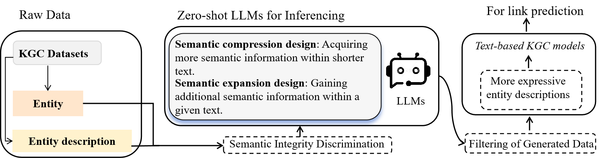

# CP-KGC
The paper is available at: [Can Text-based Knowledge Graph Completion Benefit From Zero-Shot Large Language Models?](https://arxiv.org/pdf/2310.08279.pdf) 

In this paper, we found that 
(1) We validated the effectiveness of CP-KGC using three publicly available datasets. CP-KGC enhances the semantic integrity of text and further improves the performance of text-based approaches.
(2) We demonstrated the effectiveness of quantized model (Qwen-7B-Chat-int4) by utilizing LLMs with various parameter scales. This enhances the feasibility of further research on the integration of KGC and LLMs.
(3) CP-KGC's contextual constraints strategy accurately identifies polysemous entities in datasets. Additionally, this strategy can also enhance the stability of text generation by LLMs.


CP-KGC semantic enhancement framework.


# Requirements
The models mentioned in the paper (SimKGC, KG-S2S, and KG-BERT) have their code available in their original publications, along with instructions on how to run them. You can also optimize these public data sets or field data sets according to your own ideas.

* python>=3.8
* torch>=1.8 (for mixed precision training)
* transformers>=4.15

All experiments are run with 1 A800(80GB) GPU.

The graphics required to reproduce the experiment is about 78GB (SimKGC: max length=50, batch size=1024).

CP-KGC used [SimKGC](https://github.com/intfloat/SimKGC) as the basic model in the paper. 

```
pip install transformers
```

**Step 1**: Replace the original datasets with the datasets we provide.

**Step 2**: Adjust the max tokens value, for example, set it to 30 for Table 2, 130 for Table 3, and 20, 30, 40, and 50 for Figure 2. Please keep other parameters unchanged. 

**Attention**: If you set max length = 130 and batch size = 1024 on SimKGC, it will take about 240GB of GPU memory. If you need to run the UMLS dataset on SimKGC, set max length = 30, batch size = 256, epoch = 20.

If you **don't have the computing resources**, you can use the **Qwen-7B-Chat** and **LLaMA2-7B/13B-Chat** inference tests [here](https://modelscope.cn/topic/dfefe5be778b49fba8c44646023b57ba/pub/summary). ModelScope provides sufficient computing resources for inference testing of the 13B model. You can also use quantized models for inference.

# Citation
If you find our paper or code repository helpful, please consider citing as follows:
```
@article{yang2023cp,
  title={CP-KGC: Constrained-Prompt Knowledge Graph Completion with Large Language Models},
  author={Yang, Rui and Fang, Li and Zhou, Yi},
  journal={arXiv preprint arXiv:2310.08279},
  year={2023}
}
```
